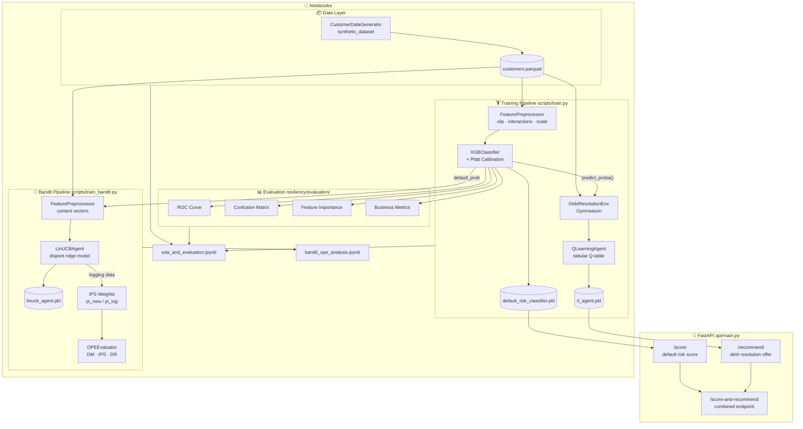
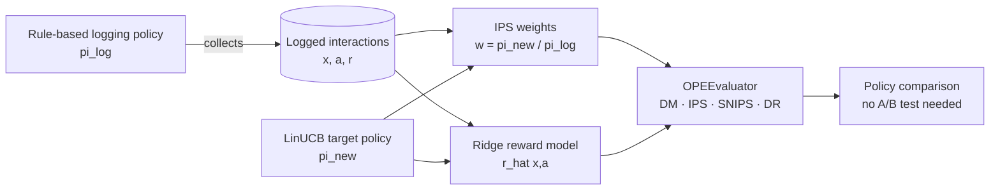

# Credit Resiliency Intelligence

> Credit Risk Business — Resiliency Intelligence Team
> Predicting default risk and recommending optimal debt resolution offers for customers in financial hardship.

---

## Architecture



---

## Project Structure

```
credit-resiliency-intelligence/
├── resiliency/                      # 📚 Custom Python library
│   ├── data/
│   │   └── generator.py             # Synthetic customer dataset generator
│   ├── models/
│   │   ├── classifier.py            # XGBoost default risk classifier
│   │   ├── rl_agent.py              # Q-learning + PPO RL agent
│   │   └── linucb.py                # LinUCB contextual bandit
│   ├── evaluation/
│   │   ├── metrics.py               # ROC curve, confusion matrix, business metrics
│   │   ├── ips.py                   # IPS / SNIPS / clipped IPS estimators
│   │   └── ope.py                   # OPEEvaluator (DM, IPS, DR, compare_policies)
│   └── utils/
│       └── preprocessing.py         # Feature engineering & sklearn transformer
│
├── api/
│   ├── main.py                      # FastAPI application
│   └── schemas.py                   # Pydantic request/response schemas
│
├── notebooks/
│   ├── eda_and_evaluation.ipynb     # Full EDA & model evaluation
│   └── bandit_ope_analysis.ipynb    # LinUCB bandit + OPE analysis
│
├── scripts/
│   ├── train.py                     # End-to-end training pipeline
│   ├── train_bandit.py              # LinUCB training + OPE comparison
│   └── generate_data.py             # Standalone data generation
│
├── tests/
│   ├── test_generator.py
│   ├── test_classifier.py
│   ├── test_rl_agent.py
│   ├── test_linucb.py               # 44 LinUCB unit tests
│   ├── test_ope.py                  # 43 OPE / IPS unit tests
│   └── test_api.py
│
├── data/                            # Generated datasets (gitignored)
├── models/                          # Saved models (gitignored)
├── requirements.txt
└── setup.py
```

---

## Quick Start

### 1. Install dependencies

```bash
pip install -r requirements.txt
pip install -e .           # installs the resiliency library in editable mode
```

### 2. Train models

```bash
python scripts/train.py --n-samples 10000 --n-rl-episodes 10000
```

Outputs saved to `models/`:
- `default_risk_classifier.pkl`
- `rl_agent.pkl`
- `plots/` — ROC curve, confusion matrix, feature importance, reward curve

### 3. Start the API

```bash
uvicorn api.main:app --reload --port 8080
```

Interactive docs: [http://localhost:8080/docs](http://localhost:8080/docs)

### 4. Run tests

```bash
pytest tests/ -v --cov=resiliency
```

### 5. Train the bandit (optional)

```bash
python scripts/train_bandit.py
```

Outputs saved to `models/`:
- `linucb_agent.pkl`
- `plots/linucb_learning_curve.png`

### 6. Open the notebooks

```bash
jupyter notebook notebooks/eda_and_evaluation.ipynb
jupyter notebook notebooks/bandit_ope_analysis.ipynb
```

---

## API Endpoints

| Method | Path | Description |
|--------|------|-------------|
| `GET`  | `/health` | Model status & health check |
| `POST` | `/score` | Default risk score for 1 customer |
| `POST` | `/score/batch` | Batch scoring (up to 1,000 customers) |
| `POST` | `/recommend` | RL-based debt resolution offer |
| `POST` | `/score-and-recommend` | Combined score + recommendation |

### Example — Score a customer

```bash
curl -X POST http://localhost:8080/score \
  -H "Content-Type: application/json" \
  -d '{
    "age": 38,
    "annual_income": 42000,
    "employment_status": 1,
    "credit_score": 580,
    "credit_utilization_pct": 0.82,
    "credit_limit": 8000,
    "current_balance": 6560,
    "months_delinquent": 3,
    "num_missed_payments_12m": 4,
    "consecutive_missed_payments": 2,
    "min_payment_ratio": 0.6,
    "months_since_last_payment": 3,
    "debt_to_income_ratio": 0.95,
    "total_debt": 39900,
    "requested_hardship_program": 1,
    "hardship_severity": 1
  }'
```

Response:
```json
{
  "default_probability": 0.7134,
  "default_prediction": 1,
  "risk_tier": "HIGH",
  "model_version": "xgb-v0.1.0"
}
```

### Example — Get recommendation

```bash
curl -X POST http://localhost:8080/recommend \
  -H "Content-Type: application/json" \
  -d '{ ...same payload... }'
```

Response:
```json
{
  "action": 1,
  "offer_type": "PAYMENT_PLAN",
  "offer_label": "Payment Plan (Extended Terms)",
  "confidence": 0.4218,
  "default_probability": 0.7134,
  "q_values": {
    "NO_ACTION": -0.1240,
    "PAYMENT_PLAN": 0.8831,
    "HARDSHIP_PROGRAM": 0.7612,
    "SETTLEMENT_OFFER": 0.5934,
    "SKIP_PAYMENT": 0.3201,
    "CREDIT_COUNSELING": 0.2187
  },
  "model_version": "qlearning-v0.1.0"
}
```

---

## Resiliency Library Modules

### `resiliency.data.generator`

```python
from resiliency.data.generator import CustomerDataGenerator, GeneratorConfig

gen = CustomerDataGenerator(GeneratorConfig(n_samples=10_000, default_rate=0.22))
df = gen.generate()
train, test = gen.train_test_split(df, test_size=0.20)
```

### `resiliency.models.classifier`

```python
from resiliency.models.classifier import DefaultRiskClassifier

clf = DefaultRiskClassifier(calibrate=True)
clf.fit(X_train, y_train)
proba = clf.predict_proba(X_test)          # float array [0, 1]
preds = clf.predict(X_test)               # binary array
result = clf.predict_with_score(X_test)   # DataFrame with prob + tier
clf.save("models/clf.pkl")
```

### `resiliency.models.rl_agent`

```python
from resiliency.models.rl_agent import QLearningAgent

agent = QLearningAgent()
agent.train(customer_df, default_probs=proba, n_episodes=10_000)
rec = agent.recommend(customer_dict, default_prob=0.72)
# rec["offer_label"] → "Payment Plan (Extended Terms)"
```

### `resiliency.evaluation.metrics`

```python
from resiliency.evaluation.metrics import plot_roc_curve, plot_confusion_matrix, business_metrics

plot_roc_curve(y_true, y_prob).savefig("roc.png")
plot_confusion_matrix(y_true, y_pred).savefig("cm.png")
biz_df = business_metrics(y_true, y_prob, y_pred)
```

---

## Advanced Methods

### Contextual Bandit — LinUCB

**Business rationale.** The Q-learning agent learns a fixed policy from offline simulation. In practice, offer acceptance rates shift over time (seasonality, macro conditions) and we want the system to keep learning from live interactions. A contextual bandit handles this naturally: it uses each customer interaction as an immediate feedback signal and balances exploration (trying less-used offers to gather data) with exploitation (recommending the offer that historically performs best for this type of customer).

**Algorithm.** LinUCB uses a disjoint ridge-regression model per arm. For arm $a$ and context vector $x$:

```
UCB_score(a, x) = x.T @ theta_a  +  alpha * sqrt(x.T @ A_a_inv @ x)
                  ─────────────────  ──────────────────────────────────
                   predicted reward        exploration bonus
```

- `A_a` starts as the identity matrix (ridge penalty λ=1) and is updated online: `A_a += x @ x.T`
- `b_a` accumulates reward signal: `b_a += r * x`
- `theta_a = A_a_inv @ b_a` — the current best-estimate reward weights
- `alpha` controls the exploration–exploitation trade-off; higher α favours unexplored arms

The bandit selects the arm with the highest UCB score, observes a reward, and updates that arm's model immediately. No re-training required.

**Four arms (simplified action space for bandit):**

| Arm | Offer | Typical use |
|-----|-------|-------------|
| `PAYMENT_PLAN` | Extended payment terms | Moderate delinquency |
| `SETTLEMENT_30PCT` | Settle at 30% of balance | Severe hardship, high default risk |
| `SETTLEMENT_50PCT` | Settle at 50% of balance | Moderate-to-high default risk |
| `HARDSHIP_PROGRAM` | Rate reduction + fee waiver | Recently distressed |

```python
from resiliency.models.linucb import LinUCBAgent, LinUCBArm

agent = LinUCBAgent(n_features=16, alpha=1.0)
arm   = agent.select_action(context_vector)   # LinUCBArm enum
agent.update(arm, context_vector, reward)     # online update
agent.save("models/linucb_agent.pkl")
loaded = LinUCBAgent.load("models/linucb_agent.pkl")
```

---

### Off-Policy Evaluation — Why It Matters

When historical data was collected by one policy (the *logging policy* — e.g. a rule-based system), we cannot naively evaluate a new policy by averaging the observed rewards. The logging policy created a **selection bias**: it preferentially chose certain offers for certain customer types, so the reward distribution in the log is not representative of what the new policy would see.

**Off-Policy Evaluation (OPE)** corrects for this bias, letting us estimate the expected reward of a new target policy using only the existing logged data — no A/B test required.

#### The Three Estimators

**Direct Method (DM)** — fit a reward model `r_hat(x, a)` on logged data, then query it under the new policy's action choices:

```
DM = mean( r_hat(x_i, pi_new(x_i)) )
```

Pros: low variance. Cons: biased if the reward model is misspecified.

**Inverse Propensity Scoring (IPS)** — reweight observed rewards by the ratio of new-to-logging propensities:

```
IPS  = mean( w_i * r_i )          w_i = pi_new(a_i | x_i) / pi_log(a_i | x_i)
SNIPS = sum( w_i * r_i ) / sum(w_i)   (self-normalised, lower variance)
```

Pros: unbiased when propensities are correctly specified. Cons: high variance when policies differ greatly (large weights). Effective Sample Size (ESS) diagnoses this: `ESS = (sum w)^2 / sum(w^2)`.

**Doubly Robust (DR)** — combines both; consistent if *either* the reward model or the propensity model is correct:

```
DR = DM + mean( w_i * (r_i - r_hat(x_i, a_i)) )
```

The second term is an IPS-weighted residual correction. When the reward model is perfect the correction is zero and DR equals DM. When propensities are perfectly specified and the reward model is zero DR equals IPS.

```python
from resiliency.evaluation.ips import importance_weights, snips_estimate, effective_sample_size
from resiliency.evaluation.ope import OPEEvaluator

weights = importance_weights(pi_log, pi_new, clip=10.0)
ess     = effective_sample_size(pi_log, pi_new)

evaluator = OPEEvaluator(contexts, actions, rewards, pi_log)
results   = evaluator.compare_policies(
    policies={"linucb": pi_linucb, "random": pi_random},
    clip=10.0,
    reward_model=ridge_model,
)
```

#### How LinUCB, IPS, and OPE Connect



#### OPE Results — Rule-based vs LinUCB vs Random

Expected results from `python scripts/train_bandit.py` on 10,000 customers (5 online passes):

| Policy | DM | IPS | SNIPS | DR | ESS% |
|--------|----|-----|-------|----|------|
| Rule-based (logging) | ~0.41 | 1.000 (ref) | 1.000 (ref) | ~0.41 | 100% |
| LinUCB (target) | ~0.53 | ~0.58 | ~0.55 | ~0.54 | ~60–75% |
| Random (baseline) | ~0.28 | ~0.31 | ~0.30 | ~0.29 | ~85–95% |

> DR is the preferred estimate — it is doubly robust to model misspecification and typically lies between DM and IPS. ESS% below 30% indicates high-variance IPS weights; interpret IPS/SNIPS cautiously in that regime.

---

## Action Space — Debt Resolution Offers

| Action | Offer | Best For |
|--------|-------|---------|
| 0 | No Action | Very low risk, monitoring only |
| 1 | Payment Plan (Extended Terms) | Moderate delinquency, stable income |
| 2 | Hardship Program (Rate Reduction) | Recently distressed, responsive customer |
| 3 | Settlement Offer (Reduced Balance) | High default risk, severe hardship |
| 4 | Skip Payment (Deferment) | Temporary hardship, good history |
| 5 | Credit Counseling Referral | High DTI, multiple collections |

---

## Reward Function

The RL agent maximises a composite reward:

```
reward = 2.0 × resolution_probability
       - 1.5 × cost_factor
       + 0.5 × customer_satisfaction
       - 0.5 × (1 - resolution_prob) × default_probability
```

Where each term is offer- and customer-specific, calibrated from domain knowledge.

---

## Model Performance (typical)

| Metric | Value |
|--------|-------|
| ROC-AUC | ~0.88–0.91 |
| PR-AUC | ~0.75–0.82 |
| Precision (default) | ~0.65 |
| Recall (default) | ~0.78 |
| Brier Score | ~0.11 |

---

## Extending to Stable-Baselines3 PPO

For continuous-state deep RL:

```python
from resiliency.models.rl_agent import train_ppo_agent

ppo_model = train_ppo_agent(
    customer_df=df,
    default_probs=all_probs,
    total_timesteps=100_000,
    model_path="models/ppo_debt_resolution",
)
```

Requires: `pip install stable-baselines3`

---

