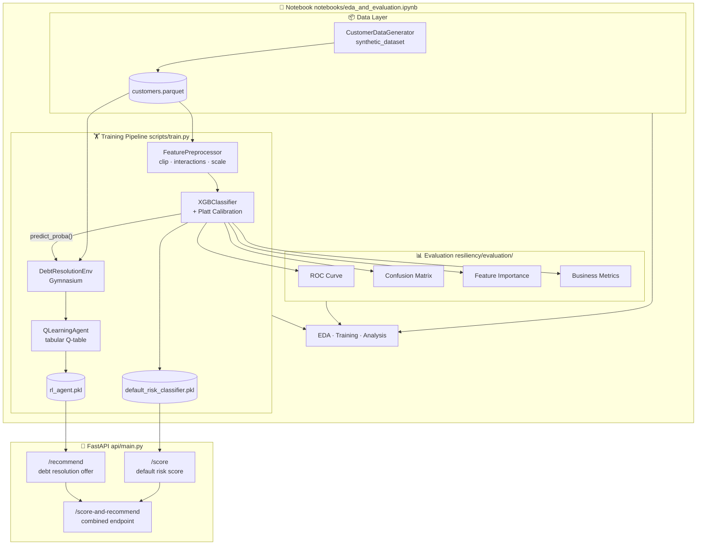

# Credit Resiliency Intelligence

> Capital One — Resiliency Intelligence Team
> Predicting default risk and recommending optimal debt resolution offers for customers in financial hardship.

---

## Architecture



---

## Project Structure

```
credit-resiliency-intelligence/
├── resiliency/                      # 📚 Custom Python library
│   ├── data/
│   │   └── generator.py             # Synthetic customer dataset generator
│   ├── models/
│   │   ├── classifier.py            # XGBoost default risk classifier
│   │   └── rl_agent.py              # Q-learning + PPO RL agent
│   ├── evaluation/
│   │   └── metrics.py               # ROC curve, confusion matrix, business metrics
│   └── utils/
│       └── preprocessing.py         # Feature engineering & sklearn transformer
│
├── api/
│   ├── main.py                      # FastAPI application
│   └── schemas.py                   # Pydantic request/response schemas
│
├── notebooks/
│   └── eda_and_evaluation.ipynb     # Full EDA & model evaluation
│
├── scripts/
│   ├── train.py                     # End-to-end training pipeline
│   └── generate_data.py             # Standalone data generation
│
├── tests/
│   ├── test_generator.py
│   ├── test_classifier.py
│   ├── test_rl_agent.py
│   └── test_api.py
│
├── data/                            # Generated datasets (gitignored)
├── models/                          # Saved models (gitignored)
├── requirements.txt
└── setup.py
```

---

## Quick Start

### 1. Install dependencies

```bash
pip install -r requirements.txt
pip install -e .           # installs the resiliency library in editable mode
```

### 2. Train models

```bash
python scripts/train.py --n-samples 10000 --n-rl-episodes 10000
```

Outputs saved to `models/`:
- `default_risk_classifier.pkl`
- `rl_agent.pkl`
- `plots/` — ROC curve, confusion matrix, feature importance, reward curve

### 3. Start the API

```bash
uvicorn api.main:app --reload --port 8080
```

Interactive docs: [http://localhost:8080/docs](http://localhost:8080/docs)

### 4. Run tests

```bash
pytest tests/ -v --cov=resiliency
```

### 5. Open the notebook

```bash
jupyter notebook notebooks/eda_and_evaluation.ipynb
```

---

## API Endpoints

| Method | Path | Description |
|--------|------|-------------|
| `GET`  | `/health` | Model status & health check |
| `POST` | `/score` | Default risk score for 1 customer |
| `POST` | `/score/batch` | Batch scoring (up to 1,000 customers) |
| `POST` | `/recommend` | RL-based debt resolution offer |
| `POST` | `/score-and-recommend` | Combined score + recommendation |

### Example — Score a customer

```bash
curl -X POST http://localhost:8080/score \
  -H "Content-Type: application/json" \
  -d '{
    "age": 38,
    "annual_income": 42000,
    "employment_status": 1,
    "credit_score": 580,
    "credit_utilization_pct": 0.82,
    "credit_limit": 8000,
    "current_balance": 6560,
    "months_delinquent": 3,
    "num_missed_payments_12m": 4,
    "consecutive_missed_payments": 2,
    "min_payment_ratio": 0.6,
    "months_since_last_payment": 3,
    "debt_to_income_ratio": 0.95,
    "total_debt": 39900,
    "requested_hardship_program": 1,
    "hardship_severity": 1
  }'
```

Response:
```json
{
  "default_probability": 0.7134,
  "default_prediction": 1,
  "risk_tier": "HIGH",
  "model_version": "xgb-v0.1.0"
}
```

### Example — Get recommendation

```bash
curl -X POST http://localhost:8080/recommend \
  -H "Content-Type: application/json" \
  -d '{ ...same payload... }'
```

Response:
```json
{
  "action": 1,
  "offer_type": "PAYMENT_PLAN",
  "offer_label": "Payment Plan (Extended Terms)",
  "confidence": 0.4218,
  "default_probability": 0.7134,
  "q_values": {
    "NO_ACTION": -0.1240,
    "PAYMENT_PLAN": 0.8831,
    "HARDSHIP_PROGRAM": 0.7612,
    "SETTLEMENT_OFFER": 0.5934,
    "SKIP_PAYMENT": 0.3201,
    "CREDIT_COUNSELING": 0.2187
  },
  "model_version": "qlearning-v0.1.0"
}
```

---

## Resiliency Library Modules

### `resiliency.data.generator`

```python
from resiliency.data.generator import CustomerDataGenerator, GeneratorConfig

gen = CustomerDataGenerator(GeneratorConfig(n_samples=10_000, default_rate=0.22))
df = gen.generate()
train, test = gen.train_test_split(df, test_size=0.20)
```

### `resiliency.models.classifier`

```python
from resiliency.models.classifier import DefaultRiskClassifier

clf = DefaultRiskClassifier(calibrate=True)
clf.fit(X_train, y_train)
proba = clf.predict_proba(X_test)          # float array [0, 1]
preds = clf.predict(X_test)               # binary array
result = clf.predict_with_score(X_test)   # DataFrame with prob + tier
clf.save("models/clf.pkl")
```

### `resiliency.models.rl_agent`

```python
from resiliency.models.rl_agent import QLearningAgent

agent = QLearningAgent()
agent.train(customer_df, default_probs=proba, n_episodes=10_000)
rec = agent.recommend(customer_dict, default_prob=0.72)
# rec["offer_label"] → "Payment Plan (Extended Terms)"
```

### `resiliency.evaluation.metrics`

```python
from resiliency.evaluation.metrics import plot_roc_curve, plot_confusion_matrix, business_metrics

plot_roc_curve(y_true, y_prob).savefig("roc.png")
plot_confusion_matrix(y_true, y_pred).savefig("cm.png")
biz_df = business_metrics(y_true, y_prob, y_pred)
```

---

## Action Space — Debt Resolution Offers

| Action | Offer | Best For |
|--------|-------|---------|
| 0 | No Action | Very low risk, monitoring only |
| 1 | Payment Plan (Extended Terms) | Moderate delinquency, stable income |
| 2 | Hardship Program (Rate Reduction) | Recently distressed, responsive customer |
| 3 | Settlement Offer (Reduced Balance) | High default risk, severe hardship |
| 4 | Skip Payment (Deferment) | Temporary hardship, good history |
| 5 | Credit Counseling Referral | High DTI, multiple collections |

---

## Reward Function

The RL agent maximises a composite reward:

```
reward = 2.0 × resolution_probability
       - 1.5 × cost_factor
       + 0.5 × customer_satisfaction
       - 0.5 × (1 - resolution_prob) × default_probability
```

Where each term is offer- and customer-specific, calibrated from domain knowledge.

---

## Model Performance (typical)

| Metric | Value |
|--------|-------|
| ROC-AUC | ~0.88–0.91 |
| PR-AUC | ~0.75–0.82 |
| Precision (default) | ~0.65 |
| Recall (default) | ~0.78 |
| Brier Score | ~0.11 |

---

## Extending to Stable-Baselines3 PPO

For continuous-state deep RL:

```python
from resiliency.models.rl_agent import train_ppo_agent

ppo_model = train_ppo_agent(
    customer_df=df,
    default_probs=all_probs,
    total_timesteps=100_000,
    model_path="models/ppo_debt_resolution",
)
```

Requires: `pip install stable-baselines3`

---

## License

MIT License © Capital One Resiliency Intelligence (Simulation)
